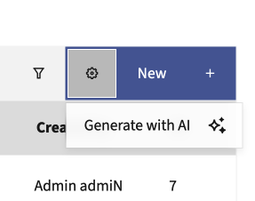
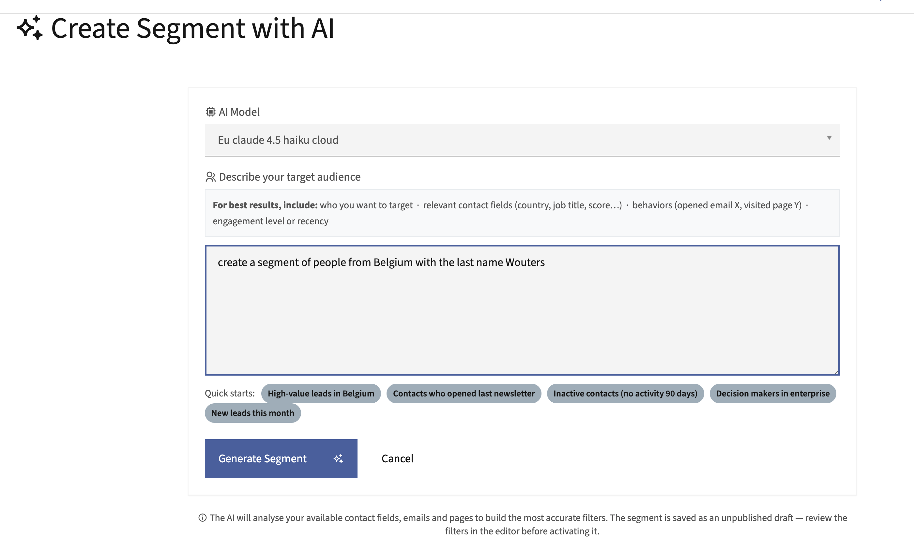
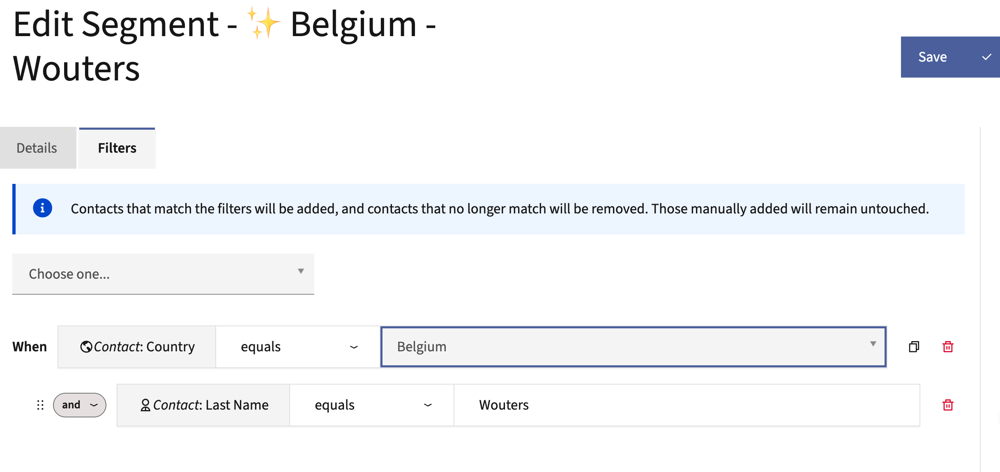

# MauticAISegmentCreatorBundle

**AI-powered contact segment generation for Mautic.** Describe your audience in plain language and get a ready-to-review segment with the right filters, no manual filter building needed.

Built by [Dropsolid](https://dropsolid.com).

---

## What it does

Instead of manually stacking filters in the Mautic segment editor, you write a sentence like:

> *"High-value leads in Belgium who opened the last newsletter"*

The plugin calls an LLM via [MauticAIconnectionBundle](https://github.com/dropsolid/MauticAIconnectionBundle), maps your description to the actual contact fields, email IDs, and page IDs available in your Mautic instance, and saves the result as an **unpublished draft segment**. You review the filters, adjust if needed, and publish.

The AI context is built from your live data (contact fields, published emails, published pages) so the generated filters reference real IDs, not placeholders.

---

## Screenshots

**1. Trigger generation from the segment list**



**2. Describe your target audience**



**3. Review the generated filters before publishing**



---

## Requirements

- Mautic 7.x
- [MauticAIconnectionBundle](https://github.com/dropsolid/MauticAIconnectionBundle) - handles LLM routing via LiteLLM

---

## Installation

1. Place this bundle in `docroot/plugins/MauticAISegmentCreatorBundle`.
2. Make sure `MauticAIconnectionBundle` is installed and configured with at least one AI model.
3. Clear Mautic cache and run plugin install from the admin panel (`/s/plugins`).

```bash
php bin/console cache:clear
php bin/console mautic:plugins:reload
```

---

## Usage

1. Go to **Segments** in the Mautic sidebar.
2. Click the settings icon next to **New** → **Generate with AI**.
3. Select an AI model, describe your target audience, and hit **Generate Segment**.
4. You land directly in the segment editor with the filters pre-filled. Review, adjust, and save.

Quick starts are included in the form for common use cases like inactive contacts, decision makers, or recent leads.

---

## How it works

The service builds a system prompt that includes all published contact fields, emails, and pages from your Mautic instance. The LLM returns a JSON structure with segment name and filters. That structure is validated, mapped to a `LeadList` entity, and saved as an unpublished segment.

Segments generated by AI are prefixed with ✨ so they're easy to spot in the list.

---

## License

MIT - see [LICENSE](LICENSE).

---

Made with care by [Frederik Wouters](https://frederikwouters.be) at [Dropsolid](https://dropsolid.com) - digital experience experts.
